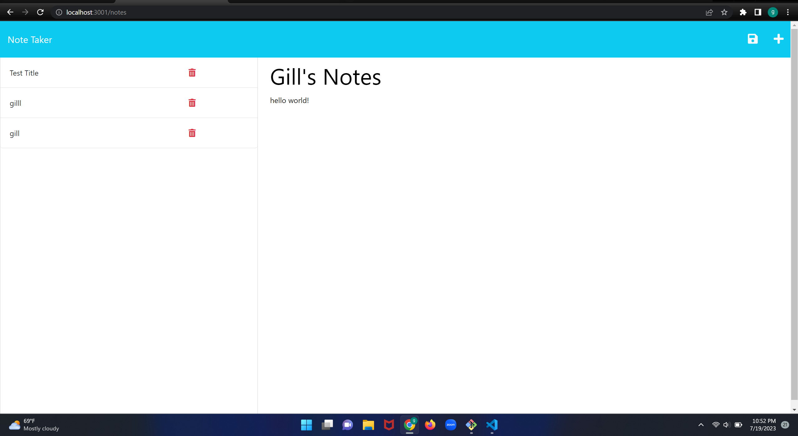

# Note Taker Starter Code

This app can be used to take notes
that can be saved and deleted

## TABLE OF CONTENTS

- [Usage](#usage)  

- [How app works](#usage)

- [Technologies](#usage)

- [Creater Info](#usage)

## Usage
This app is used to take personal notes that can be deleted
and stored. It uses local storage to save notes. 

## How app works
1. open app
2. give note a title    
3. tab to note text
4. write your note
5. click the save icon in top left corner to save note
6. to delete note click red garabage can

## Technologies

html
javascript
css
express.js
jest
database js
npm

## Creater Info

https://github.com/cantavexp/m3pg.git

# Take-Note-Of
